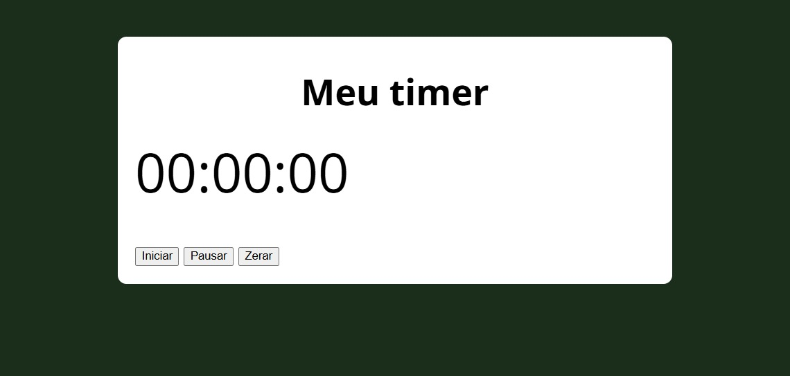
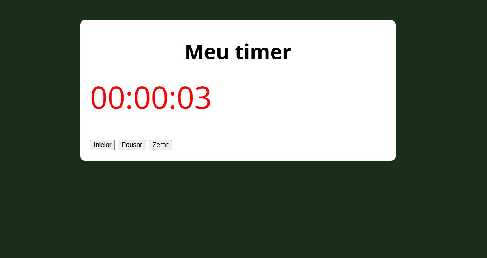

# ⏱️ Cronômetro

## 📌 Descrição
Projeto de **cronômetro funcional** desenvolvido com HTML, CSS e JavaScript.  
A interface exibe um contador zerado (`00:00:00`) e três botões de controle: **Iniciar**, **Pausar** e **Zerar**.

---

## ⚙️ Funcionalidades

- **Iniciar** → Inicia a contagem do tempo.
- **Pausar** → Interrompe a contagem e altera a cor do cronômetro para vermelho.
- **Iniciar novamente** → Retoma a contagem de onde parou.
- **Zerar** → Reinicia o cronômetro para `00:00:00`.

---

## 🛠️ Tecnologias utilizadas
- HTML5
- CSS3
- JavaScript (JS)

---

## 📸 Preview
### 🔹 Tela inicial


### 🔹 Cronômetro pausado


---

## 🚀 Como visualizar

Você pode abrir o projeto localmente:

1. Baixe ou clone este repositório:
   - Clique em **Code > Download ZIP** e extraia os arquivos  
   - ou use o comando:
     ```bash
     git clone https://github.com/WellingthonSchuh/Cronometro.git
     ```

2. Abra o arquivo `index.html` em qualquer navegador moderno.

Ou

1. Acesse o site:
   -https://wellingthonschuh.github.io/Cronometro/

> ⚠️ O projeto é totalmente seguro. Nenhum dado é armazenado — o cronômetro funciona apenas localmente no navegador.

---

## 📚 Aprendizados
- Manipulação de tempo com `setInterval` e `clearInterval`
- Controle de estado com variáveis e eventos
- Alteração de estilos com JavaScript
- Criação de lógica de pausa e reinício

---

## 👨‍💻 Autor
Feito por **Wellingthon Schuh**  
🔗 [LinkedIn](https://www.linkedin.com/in/wellingthonschuh)
